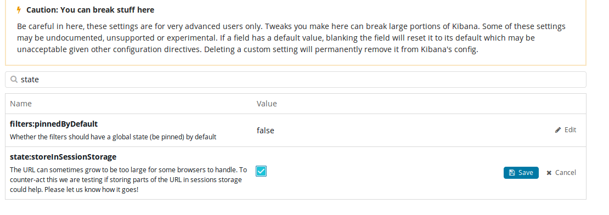

The URL can sometimes grow to be too large for some browsers to handle. To counter-act this change the **state:storeInSessionStorage** setting to true in the Management -> Advance Settings section.  See screenshot.

