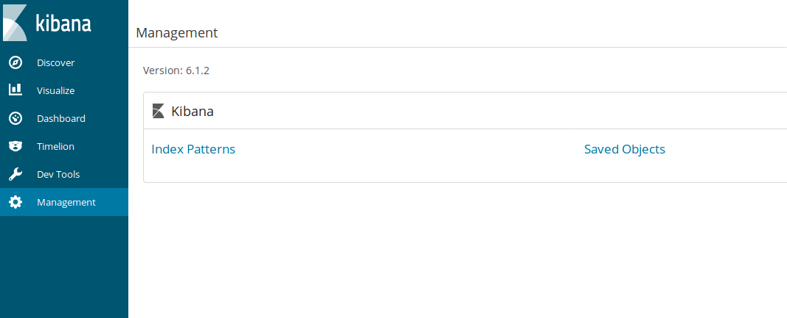

This will allow for the end user to click on the malware name (in the table for the report) and it will take them to the Autofocus page with information about that tag.  They must have their own login to Autofocus for this to work.
    
Click on the Management tab on the left hand side and click "Index Patterns"

    
Make sure you are looking at the sfn-dns-event index pattern and scroll down to find event_tag.public_tag_name.keyword and select the edit icon (pencil) on the far right of that row:

    
Use the dropdown under **Format** and select *Url*
Under **Type** ensure that *Link* is selected
In the **Url Template** box, place this text: https://autofocus.paloaltonetworks.com/#/tag/Unit42.{{value}}
The **Label Template** text box should have the value: {{value}}
  
You page should look similar to below. If it does, click the ***Update Field*** button at the bottom of the page.

#### You can do the above URL linking with just about any field.  It is not limited to just the one documented here.
