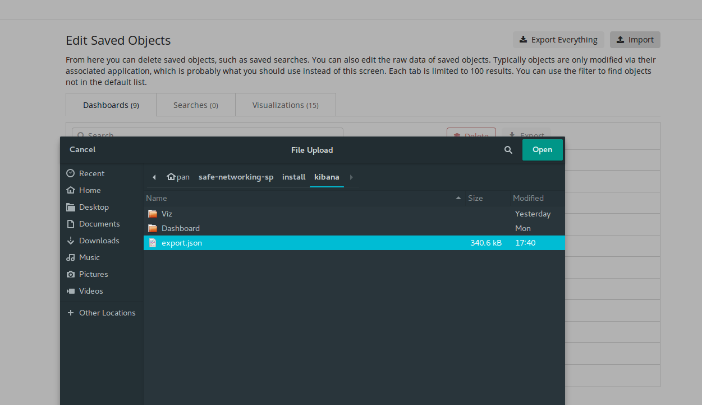
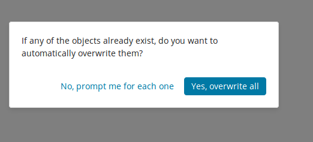
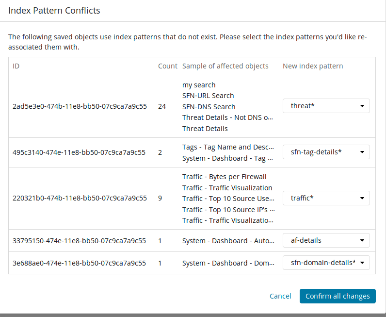
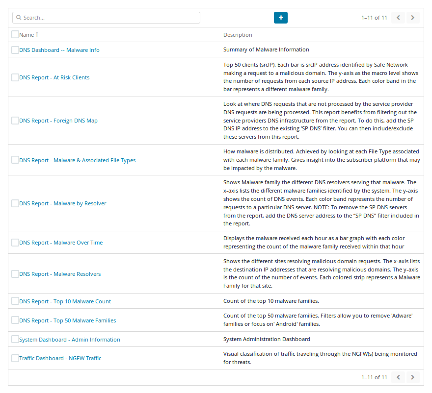

## This should be done after first install and any upgrades as well.  This will ***not*** overwrite any custom visualizations or dashboards.  It will only reinstall the defaults and add any new visualizations and dashboards built into the repository.
Import the pre-defined Reports and Dashboards from the install/kibana/export.json file included in the repository
    
Click on the Management tab on the left hand side and click "Saved Objects"

    
On the Saved Objects page, click on the Import icon in the top right and navigate to select the export.json file from install/kibana:

    
When importing, it will ask if it should overwrite or prompt.  Select overwrite:

    
As the visualizations get imported, you will need to select the index that they are associated with.  You should make the imports the same as the following screenshot.  Your visualizations may be in a different order.  Verify that the "Sample of affected objects" and "New index pattern" columns match what is in the screenshot.

    
Click on the Dashboard tab on the left hand side of the screen, If everything goes as planned, you should now have multiple dashboards and reports to start viewing the data.

    