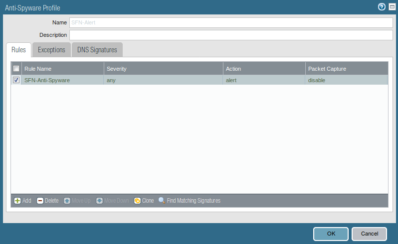
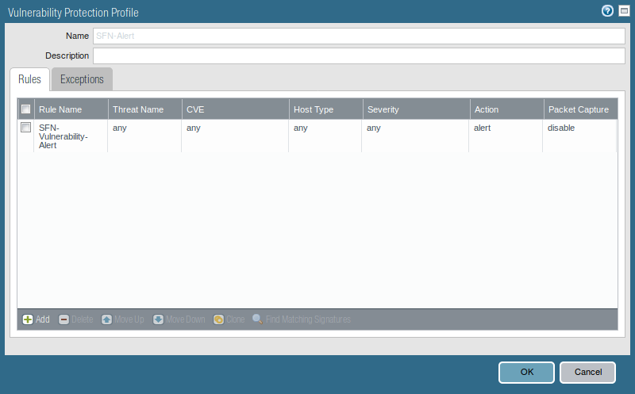
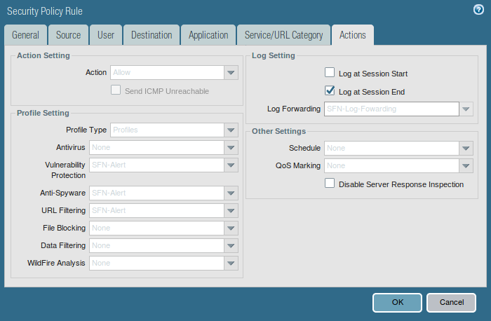

# Create Syslog Server Profile 
1. Select **Device** -> **Server Profiles** -> **Syslog**.
2. Click  and enter a Name for the profile.
3. If the firewall has more than one virtual system (vsys), select the Location (vsys or Shared) where this profile will be available.

4. For the SFN server, click Add and enter the information that the firewall requires to connect to it:
    - **Name** — Unique name for the server profile.
    - **Syslog Server** — IP address or fully qualified domain name (FQDN) of the SFN server.
    - **Transport** — Select TCP, UDP, or SSL (TLS) as the protocol for communicating with the SFN server. This will match whatever you have set in the pan-sfn.conf file - default is TCP.
    - **Port** — The port number on which to send syslog messages (default for SFN is TCP on port 5514).
    - **Format** — Select the ***BSD*** format only (the default). 
    - **Facility** — Select ***LOG_USER***.

Do **not** customize the format of the messages at this time.  This is not needed and the SFN schemas use the default BSD message format only.

The new profile should look similar to the below, substituting your IP (and port) of your SFN server. 

   

# Configure syslog forwarding for Traffic & Threat log 

1. Select **Objects** -> **Log Forwarding**, click , and enter a Name to identify the profile.
2. Click  in the Log Forwarding Profile pane and enter a Name to identify the Profile Match List.
3. Select ***traffic*** in the dropdown for **Log Type**.
4. In the **Syslog** Forward Method box, click click  and select the previously defined *Syslog Server Profile*
5. Click the "OK" button.
6. Repeat steps 2 thru 5 but in step 3, select ***threat*** in the dropdown for **Log Type** - the rest of the steps are identical.

The new profile should look similar to the below.

   

# Configure Security Profiles specific to SFN 
### Anti-Spyware 
1. Select **Objects** -> **Security Profiles** -> **Anti-Spyware**, click , and enter a Name to identify the profile.
2. Click  in the Anti-Spyware Profile pane and enter a Name to identify the Profile Match List.
3. Use the following values:
    - **Threat Name** — any
    - **Category** — any
    - **Action** — Alert
    - **Packet Capture** — disable
    - **Severity** - any (All severities)
4. Click the "OK" button.

The new profile should look similar to the below. 

   

### Vulnerability Protection 
1. Select **Objects** -> **Security Profiles** -> **Vulnerability Protection**, click , and enter a Name to identify the profile.
2. Click  in the Vulnerability Protection Profile pane, Rule tab and enter a Name to identify the Profile Match List.
3. Use the following values:
    - **Threat Name** — any
    - **Action** — Default
    - **Host Type** - any 
    - **Packet Capture** — disable
    - **Category** — any
    - **CVE** — Any (checkbox)
    - **Vendor ID** — Any (checkbox)
    - **Severity** - any (All severities)
4. Click the "OK" button.

The new profile should look similar to the below.  

   

### URL Filtering 
1. Select **Objects** -> **Security Profiles** -> **URL Filtering**, click , and enter a Name to identify the profile.
2. Hover over the *Site Access* header and a down arrow should appear.  Click the down arrow and select *Set All Actions* -> *alert*
3. Click the "OK" button.

The new profile should look similar to the below. 

   

# Assign the Log Forwarding profile to a policy rule.
To trigger log forwarding for both traffic and threat:

1. Select **Policies** -> **Security** and edit the rule to use.
2. Select *Actions* and select the Log Forwarding profile you created in [Create Syslog Server Profile](#create-profile) un **Log Setting**
3. For Traffic logs, select *Log at Session End* checkbox
4. For Threat, under **Profile Setting**, set the Profile Type to Profiles, and then select the security profiles previously created for [Vulnerability Protection](#vuln-protection), [Anti-Spyware](#anti-spyware), [URL Filtering](#url-filtering).
5. Click OK to save the rule

The security policy rule should look similar to the below. 

   
