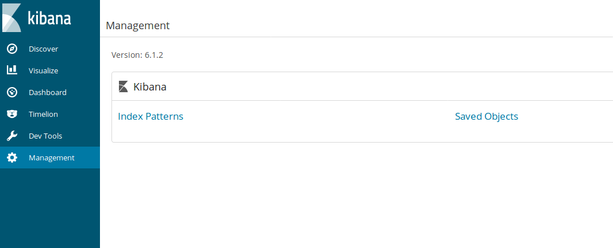
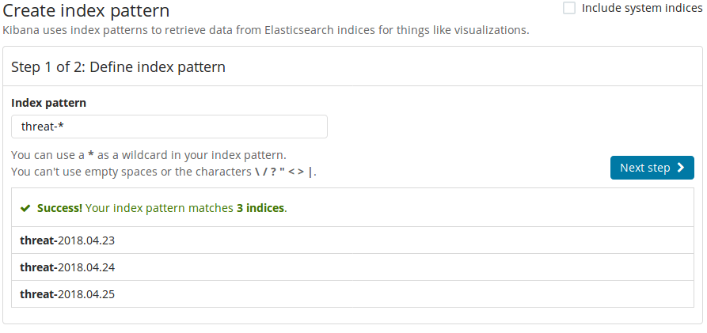
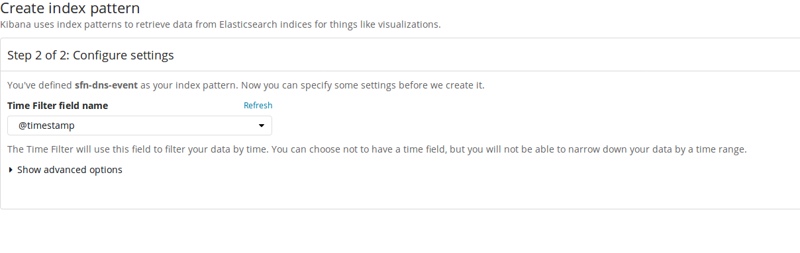

### NOTE: This will not work if there is no data to index.  Make sure your firewall is sending data first!!
 

Click on the Management tab on the left hand side and click "Index Patterns"
<table><tr><td>
    
</td></tr></table>
  
The first index to set up is the threat index.  Put threat-* in the text box and it should match any indexes already in ElasticSearch as in the screenshot.  Click the next step button.
  
<table><tr><td>
    
</td></tr></table> 
For the "Time filter field name" select @timestamp in the dropdown and click the create index pattern button  
<table><tr><td>
    
</td></tr></table>
 

## Follow the same procedure for the traffic-* index

We also need to create index patters for af-details, sfn-domain-details, and sfn-tag-details.  This is the same procedure, but with the following caveats for each index:
 - sfn-domain-details* and sfn-tag-details* indexes: in the "Time filter field name" dropdown select "doc_updated"
 - af-details* index: in the "Time filter field name" dropdown select "I do not want to use the Time Filter" 
