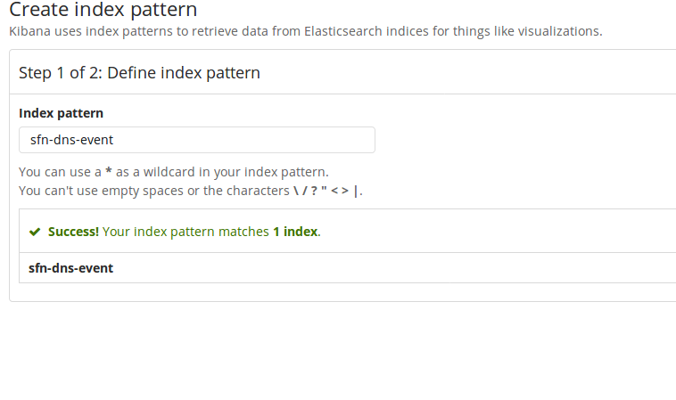

### NOTE: This will not work if there is no data to index.  Make sure your firewall is sending data first!!
 

Click on the Management tab on the left hand side and click "Index Patterns"

  
The first index to set up is the sfn-dns-event index.  Put that name in the text box and it should match the index as in the screenshot.  Click the next step button.
  
 
For the "Time filter field name" select the updated_at in the dropdown and click the create index pattern button
##### NOTE: The screenshot shows @timestamp - be sure to select **updated_at**

 
## Follow the same procedure for the af-details, sfn-domain-details and sfn-tag-details indexes, but in the "Time filter field name" dropdown select "I don't want to use the Time Filter"
